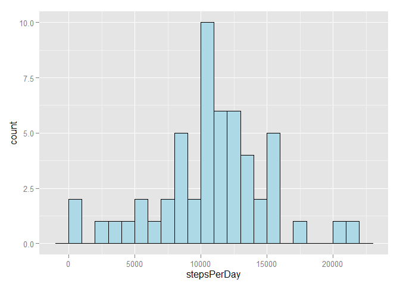
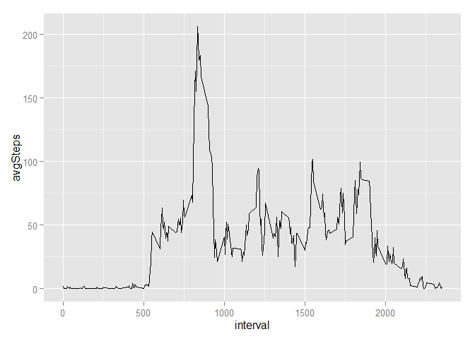
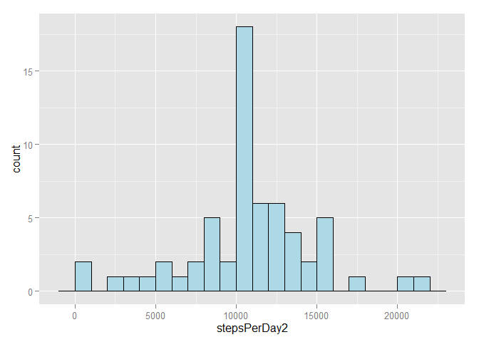
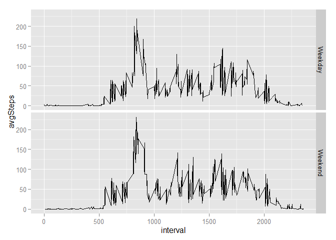

# Reproducible Research: Peer Assessment 1


## Loading and preprocessing the data

```r
setwd("G:/Coursera/ReproducibleResearch")
options(stringsAsFactors = FALSE)
library(ggplot2)

#Load data.
stepData <- read.csv("activity.csv")

#Change date to a date variable.
stepData$date <- as.Date(stepData$date)
```


## What is mean total number of steps taken per day?

```r
#Calculate steps per day by summing across date variable.
stepsPerDay <- with(stepData, tapply(steps, date, sum))

#Produce histogram.
ggplot(as.data.frame(stepsPerDay)) + 
  geom_histogram(aes(stepsPerDay), fill = "lightblue", col = "black", binwidth = 1000)
```

 

```r
#Calculate mean and median steps per day.
print(paste("Mean =", round(mean(stepsPerDay, na.rm = TRUE), 1)))
```

```
## [1] "Mean = 10766.2"
```

```r
print(paste("Median =", round(median(stepsPerDay, na.rm = TRUE), 1)))
```

```
## [1] "Median = 10765"
```


## What is the average daily activity pattern?

```r
#Calculate the activity pattern by averaging across interval variable.
dailyPattern <- with(stepData, tapply(steps, interval, mean, na.rm = TRUE))
dailyPattern <- data.frame(interval = as.integer(names(dailyPattern)), 
                           avgSteps = unname(dailyPattern))

#plot the pattern.
qplot(interval, avgSteps, data = dailyPattern, geom = "line")
```

 

```r
#find the interval with the highest number of steps on average.
print(subset(dailyPattern, avgSteps == max(dailyPattern$avgSteps))$interval)
```

```
## [1] 835
```


## Imputing missing values

```r
#Calculate and report the total number of missing values in the dataset.
sum(is.na(stepData$steps))
```

```
## [1] 2304
```

```r
#Using the 5 minute interval mean to impute missing values.
missingData <- stepData[is.na(stepData$steps), ]

missingData$steps <- 
  dailyPattern$avgSteps[match(missingData$interval, dailyPattern$interval)]


#Create a new dataset that is equal to the original dataset but with the missing data filled in.
#rbind combines the rows, adding the imputed data onto the end of the non-missing original data.
stepDataComplete <- rbind(stepData[!is.na(stepData$steps), ], missingData)

#Make a histogram of the total number of steps taken each day and Calculate and report 
#the mean and median total number of steps taken per day. Do these values differ from 
#the estimates from the first part of the assignment? What is the impact of imputing 
#missing data on the estimates of the total daily number of steps?
stepsPerDay2 <- with(stepDataComplete, tapply(steps, date, sum, na.rm = TRUE))
ggplot(as.data.frame(stepsPerDay2)) + 
  geom_histogram(aes(stepsPerDay2), fill = "lightblue", col = "black", binwidth = 1000)
```

 

```r
#Calculate mean and median steps per day.
print(paste("Mean =", round(mean(stepsPerDay2, na.rm = TRUE), 1)))
```

```
## [1] "Mean = 10766.2"
```

```r
print(paste("Median =", round(median(stepsPerDay2, na.rm = TRUE), 1)))
```

```
## [1] "Median = 10766.2"
```

```r
print("The mean has not been altered, because the mean was used when imputing values. The median has been made equal to the mean, because one of the imputed days is now the median value.")
```

```
## [1] "The mean has not been altered, because the mean was used when imputing values. The median has been made equal to the mean, because one of the imputed days is now the median value."
```


## Are there differences in activity patterns between weekdays and weekends?

```r
#Create a new factor variable in the dataset with two levels - "weekday" and "weekend" 
#indicating whether a given date is a weekday or weekend day.

stepDataComplete$weekday <- 
  factor(!(weekdays(stepDataComplete$date) %in% c("Saturday", "Sunday")), 
         labels = c("Weekday", "Weekend"))

dailyPattern2 <- as.data.frame(with(stepDataComplete, tapply(steps, list(interval, weekday), 
                                              mean, na.rm = TRUE)))

dailyPattern2 <- data.frame(
  interval = as.numeric(rownames(dailyPattern2)),
  weekday = c(rep("Weekday", length(dailyPattern2)), rep("Weekend", length(dailyPattern2))), 
  avgSteps = as.numeric(c(dailyPattern2$Weekday, dailyPattern2$Weekend))
)

qplot(interval, avgSteps, data = dailyPattern2, geom = "line", facets = weekday ~ .)
```

 
